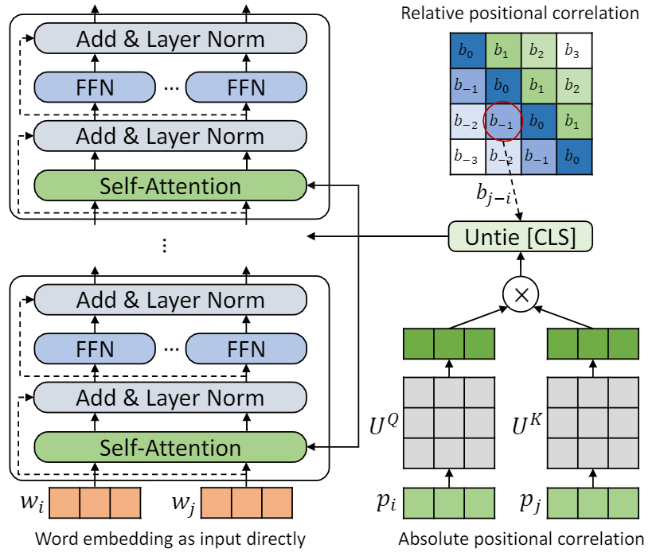
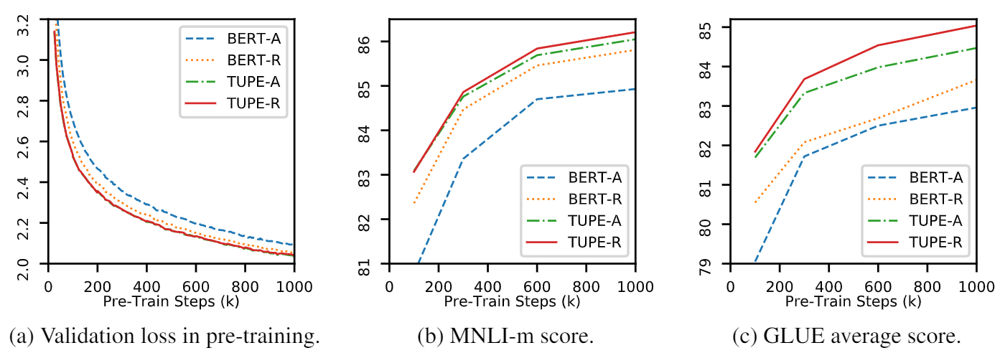

# TUPE (Transformer with Untied Positional Encoding)

Implementation for the paper [Rethinking Positional Encoding in Language Pre-training](https://arxiv.org/abs/2006.15595). 

<p align="center">

</p>

## Brief Introduction

This repo is to demonstrate TUPE (Transformer with Untied Positional Encoding). The algorithm details could be found in our paper. TUPE can outperform other baselines on GLUE benchmark by a large margin. In particular, it can achieve a higher score than baselines while only using 30% pre-training computational costs. 

<p align="center">

</p>


Due to limited computational resources, we use the most widely-used pre-training model, BERT-Base, for verification. However, please note that our method could be used for larger (and better) Transformer-based models, like RoBERTa, ELECTRA and UniLM, and further improve them. Besides, since the modification is simple and easy, you can easily apply TUPE in your models.

Our implementation is based on [fairseq](https://github.com/pytorch/fairseq), with several changes:
1. update [`fairseq/modules/transformer_sentence_encoder.py`](fairseq/modules/transformer_sentence_encoder.py) and [`fairseq/modules/multihead_attention.py`](fairseq/modules/multihead_attention.py) for untied positional encoding.
2. implement BERT [`fairseq/models/bert/model.py`](fairseq/models/bert/model.py), based on the code of RoBERTa.
3. some other minor changes to support `max-epoch` with `warmup-ratio` in finetune, instead of setting different `total-num-update` and `warmup-updates` for different tasks.


## Requirements and Installation

More details see [fairseq](https://github.com/pytorch/fairseq). Briefly,

* [PyTorch](http://pytorch.org/)
* Python version >= 3.5
* NVIDIA's [apex](https://github.com/NVIDIA/apex) library with the `--cuda_ext` installation option, for mixed precision training
* You may need [NCCL](https://github.com/NVIDIA/nccl) for multi-node distributed training

**Installing from source**

To install TUPE from source and develop locally:
```bash
git clone https://github.com/guolinke/TUPE
cd TUPE
pip install --editable .
```

## Getting Started

### Data Pre-Processing

The pre-processing relies on [mosesdecoder](https://github.com/moses-smt/mosesdecoder), you can run the following script to pull it.

```bash
cd TUPE
git submodule update --init
```

#### Pretraining Data
Refer to the steps in [`preprocess/pretrain/process.sh`](preprocess/pretrain/process.sh).

#### Downstream Data
Refer to the steps in [`preprocess/glue/process.sh`](preprocess/glue/process.sh).

### Pre-Training

```bash
DATA_DIR=./path_to_your_data/
SAVE_DIR=./your_own_save_path/
TOTAL_UPDATES=1000000
WARMUP_UPDATES=10000
PEAK_LR=0.0001
MAX_POSITIONS=512
MAX_SENTENCES=16
UPDATE_FREQ=1
SEED=your_seed
python train.py $DATA_DIR --fp16 --num-workers 16 --ddp-backend=c10d \
    --task masked_lm --criterion masked_lm --arch bert_base \
    --sample-break-mode complete --tokens-per-sample $MAX_POSITIONS \
    --optimizer adam --adam-betas '(0.9, 0.999)' --adam-eps 1e-6 --clip-norm 1.0 \
    --lr-scheduler polynomial_decay --lr $PEAK_LR --warmup-updates $WARMUP_UPDATES --total-num-update $TOTAL_UPDATES \
    --dropout 0.1 --attention-dropout 0.1 --weight-decay 0.01 \
    --max-sentences $MAX_SENTENCES --update-freq $UPDATE_FREQ --seed $SEED \
    --mask-prob 0.15 \
    --embedding-normalize \
    --max-update $TOTAL_UPDATES --log-format simple --log-interval 100 \
    --keep-updates-list 100000 300000 600000 1000000 \
    --save-interval-updates 25000 --keep-interval-updates 3 --no-epoch-checkpoints --skip-invalid-size-inputs-valid-test \
    --save-dir $SAVE_DIR --rel-pos

```

The above setting is for 16 V100 GPUs, and the batch size is 256 (`n_gpu * MAX_SENTENCES * UPDATE_FREQ`). You may need to change `MAX_SENTENCES` or `UPDATE_FREQ` according to your environment. To disable relative position, you can remove `--rel-pos` .


### Fine-Tuning

```bash
DATA_DIR=./path_to_your_downstream_data
SAVE_DIR=./path_to_your_save_dir
BERT_MODEL_PATH=./path_to_your_checkpoint
BATCH_SIZE=32
N_EPOCH=10     # 5 for MNLI, QNLI, QQP
SEED=your_seed
WARMUP_RATIO=0.06
N_CLASSES=2     # 3 for MNLI, 1 for STS-B
LR=0.00005     # search from 2e-5, 3e-5, 4e-5, 5e-5
METRIC=accuracy     # mcc for CoLA, pearson for STS-B

python train.py $DATA_DIR --fp16 --fp16-init-scale 4 --threshold-loss-scale 1 --fp16-scale-window 128 \
    --restore-file $BERT_MODEL_PATH \
    --max-positions 512 \
    --max-sentences $BATCH_SIZE \
    --max-tokens 4400 \
    --task sentence_prediction \
    --reset-optimizer --reset-dataloader --reset-meters \
    --required-batch-size-multiple 1 \
    --init-token 0 --separator-token 2 \
    --arch bert_base \
    --criterion sentence_prediction \
    --num-classes $N_CLASSES \
    --dropout 0.1 --attention-dropout 0.1 \
    --weight-decay 0.01 --optimizer adam --adam-betas '(0.9, 0.999)' --adam-eps 1e-06 \
    --clip-norm 1.0 --validate-interval-updates 2 \
    --lr-scheduler polynomial_decay --lr $LR --warmup-ratio $WARMUP_RATIO \
    --max-epoch $N_EPOCH --seed $SEED --save-dir $SAVE_DIR --no-progress-bar --log-interval 100 --no-epoch-checkpoints --no-last-checkpoints --no-best-checkpoints \
    --find-unused-parameters --skip-invalid-size-inputs-valid-test --truncate-sequence --embedding-normalize \
    --tensorboard-logdir . \
    --best-checkpoint-metric $METRIC --maximize-best-checkpoint-metric --rel-pos
```

To speed up finetune, we set `N_EPOCH=5` for MNLI, QNLI and QQP, and `N_EPOCH=10` for others. For MNLI, `N_CLASSES=3` and an additional setting `--valid-subset valid,valid1` is used for evaluating MNLI-m/-mm together. STS-B is a regression task, so we set `N_CLASSES=1`, with additional settings `--regression-target` and `METRIC=pearson`. For CoLA, we set `METRIC=mcc`.

`LR` is searched from `{2e-5, 3e-5, 4e-5, 5e-5}`, each `LR` will be run by 5 different seeds, and we use the median of them as the result of that `LR`. The result of the best `LR` will be used.

**NOTE**: If your pretraining model used `--rel-pos`, you should set `--rel-pos` in the finetune, otherwise you should remove it.

We also release the [checkpoint](https://guolinke.blob.core.windows.net/tupe/tupe_ckp.tar.gz) of TUPE-R (with `--rel-pos`), for reproducibility.

## Reference

You can cite our paper by
```
@article{ke2020rethinking,
  title={Rethinking Positional Encoding in Language Pre-training},
  author={Ke, Guolin and He, Di and Liu, Tie-Yan},
  journal={arXiv preprint arXiv:2006.15595},
  year={2020}
}
```
